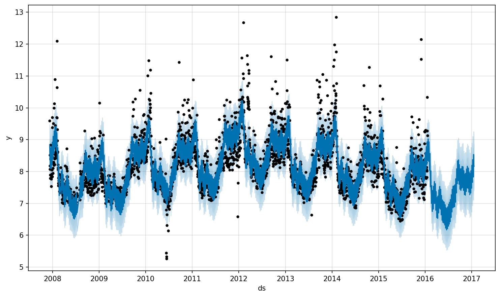

+++
title = "TS 201: Prophet"
slug = "ts-201"
date = "2028-11-30"
type = "post"
draft = false
math = true
tags = ["prophet", "orbit", "forecasting", "time-series"]
categories = ["mcmc"]
description = "An overview of Facebook Prophet, a generalized additive model for time series forecasting."
+++

Welcome to **TS 201**! In the previous posts, we covered [ARIMA](../ts-102), [Exponential Smoothing](../ts-103), and [Bayesian Structural Time Series](../ts-104). Today, we look at **Prophet**, a popular forecasting tool developed by Facebook (now Meta).

This post is based on Section 2.3 of the paper [*Orbit: Probabilistic Forecast with Exponential Smoothing*](https://arxiv.org/abs/2004.08492).

## What is Prophet?

Prophet (Taylor & Letham, 2018) takes a different approach compared to traditional state-space models. Instead of explicitly modeling the time-based dependence of each observation (like AR or MA terms), Prophet frames the forecasting problem as a **curve-fitting exercise**.

It uses a **Generalized Additive Model (GAM)** structure, decomposing the time series into three main components:

$$
y_t = g_t + s_t + h_t + \epsilon_t
$$

Where:
*   $g(t)$: **Trend** function (modeling non-periodic changes).
*   $s(t)$: **Seasonality** (modeling periodic changes).
*   $h(t)$: **Holidays** (modeling irregular schedules).
*   $\epsilon_t$: Error term (assumed normal).

### 1. Trend ($g(t)$)

The trend component is the backbone of the model. Prophet offers two main growth models:

#### Piecewise Linear Growth
This is the default setting. It models the trend as a series of linear segments, allowing the growth rate to change at specific points in time (changepoints).

$$
g(t) = (k + \mathbf{a}(t)^\top \boldsymbol{\delta})t + (m + \mathbf{a}(t)^\top \boldsymbol{\gamma})
$$

Where $k$ is the base growth rate, $\boldsymbol{\delta}$ represents the rate adjustments at changepoints, and $\mathbf{a}(t)$ is a vector of indicators for active changepoints.

#### Logistic Growth
For cases where the trend is expected to saturate (e.g., market cap, server capacity), Prophet uses a logistic growth model:

$$
g(t) = \frac{C(t)}{1 + \exp(-k(t - m))}
$$

Here, $C(t)$ is the carrying capacity, which can be time-varying and must be specified by the user.

#### Automatic Changepoint Detection
One of Prophet's key features is its ability to automatically detect changepoints. It puts a sparse prior (Laplace distribution) on the rate adjustments $\boldsymbol{\delta}$, effectively shrinking most of them to zero unless the data strongly suggests a change.

### 2. Seasonality ($s(t)$)

Prophet handles multi-period seasonality (e.g., weekly + yearly) using **Fourier Series**.

$$
s(t) = \sum_{n=1}^N \left( a_n \cos\left(\frac{2\pi n t}{P}\right) + b_n \sin\left(\frac{2\pi n t}{P}\right) \right)
$$

For yearly seasonality ($P=365.25$), it typically uses $N=10$. For weekly seasonality ($P=7$), it uses $N=3$. This flexible approach allows it to model complex periodic patterns without rigid assumptions.

### 3. Holidays ($h(t)$)

Holidays are modeled as a list of specific dates. For each holiday $i$, let $D_i$ be the set of dates. We assign a parameter $\kappa_i$ to represent the impact of that holiday.

$$
h(t) = \sum_{i} \kappa_i \mathbb{1}(t \in D_i)
$$

This is crucial for business forecasting, where events like "Black Friday" or "Super Bowl" can have massive, irregular impacts.

## Estimation and "Analyst-in-the-Loop"

Prophet uses **Maximum A Posteriori (MAP)** estimation by default to fit the model parameters quickly. However, it also supports full MCMC sampling (using Stan) to quantify uncertainty in the trend and seasonality.

### The Philosophy
Taylor & Letham emphasize an **"Analyst-in-the-Loop"** approach. Instead of a fully automated "black box," Prophet is designed to have interpretable parameters that domain experts can tweak:
*   **Capacities**: Analysts know the physical limits of their system.
*   **Changepoints**: Analysts know when a product launch happened.
*   **Holidays**: Analysts know which events matter.

By framing forecasting as curve-fitting, Prophet is robust to missing data and shifts in the trend, and typically handles outliers well.

## Real-World Example: Peyton Manning's Wikipedia Page Views

To demonstrate Prophet's capabilities, the authors (and the official documentation) use a dataset of **log-transformed daily page views for Peyton Manning's Wikipedia page** from 2007 to 2016.

This dataset perfectly illustrates why a flexible, decomposable model is needed:

1.  **Multiple Seasonality**:
    *   **Weekly**: Visits peak on Sundays and Mondays (game days and post-game discussions) during the season.
    *   **Yearly**: Visits spike during the NFL season and playoffs, dropping off in the off-season.
2.  **Trend Changes**: Manning's popularity (and thus page views) shifted over time, notably declining after his retirement. Prophet's automatic changepoint detection captures these shifts without manual intervention.
3.  **Special Events (Holidays)**: The biggest spikes in the data correspond to specific events like Super Bowl appearances or playoff games. By feeding a list of these "holidays" into the model, Prophet can explicitly account for these irregularities, preventing them from distorting the baseline trend.

By decomposing the series into these components ($g(t) + s(t) + h(t)$), Prophet provides a transparent forecast where analysts can visually inspect *why* the model predicts a spike on a certain day—was it the trend, the season, or a specific event?

## Hands-On: Prophet Demonstration

Let's walk through a practical example using Python and the Prophet library to forecast Peyton Manning's Wikipedia page views.

### Setup and Data Loading

First, we load the necessary libraries and the dataset:

```python
import pandas as pd
from prophet import Prophet
import matplotlib.pyplot as plt

# Load the dataset
url = 'https://raw.githubusercontent.com/facebook/prophet/main/examples/example_wp_log_peyton_manning.csv'
df = pd.read_csv(url)

# Prophet requires columns 'ds' (date) and 'y' (value)
df.head()
```

**Output:**
```
           ds         y
0  2007-12-10  9.590761
1  2007-12-11  8.519590
2  2007-12-12  8.183677
3  2007-12-13  8.072467
4  2007-12-14  7.893572
```

The dataset contains **2,905 daily observations** from December 10, 2007 to January 20, 2016. The `y` column represents the **log-transformed page views**.

### Model Fitting

Prophet makes it incredibly simple to fit a model:

```python
m = Prophet()
m.fit(df)
```

Behind the scenes, Prophet uses Stan to perform MAP estimation. The model automatically:
- Detects changepoints in the trend
- Fits weekly and yearly seasonality using Fourier series
- Estimates uncertainty in the forecast

### Making Predictions

To forecast 365 days into the future:

```python
# Create future dataframe
future = m.make_future_dataframe(periods=365)
print(f"Future dataframe contains {len(future)} dates")
print(future.tail())
```

**Output:**
```
Future dataframe contains 3270 dates
             ds
3265 2017-01-15
3266 2017-01-16
3267 2017-01-17
3268 2017-01-18
3269 2017-01-19
```

Now we generate the forecast:

```python
forecast = m.predict(future)
forecast[['ds', 'yhat', 'yhat_lower', 'yhat_upper']].tail()
```

**Output:**
```
             ds      yhat  yhat_lower  yhat_upper
3265 2017-01-15  7.948293    7.009693    8.876442
3266 2017-01-16  8.386348    7.503513    9.253080
3267 2017-01-17  8.237026    7.333166    9.084187
3268 2017-01-18  8.058068    7.201060    8.905391
3269 2017-01-19  7.979349    7.137564    8.826581
```

The `yhat` column is the point forecast, while `yhat_lower` and `yhat_upper` provide the 80% uncertainty interval.

### Visualizing the Forecast

Prophet provides a built-in plotting function to visualize the forecast:

```python
fig1 = m.plot(forecast)
plt.savefig('prophet_forecast.png')
```



The plot shows:
- **Black dots**: Historical observations
- **Blue line**: Forecasted values
- **Light blue shaded area**: 80% uncertainty interval

Notice how the uncertainty grows as we move further into the future, which reflects the model's decreasing confidence about long-term predictions.

### Component Decomposition

One of Prophet's strengths is its interpretability. We can visualize each component:

```python
fig2 = m.plot_components(forecast)
plt.savefig('prophet_components.png')
```


This decomposition reveals:

1. **Trend**: Shows Peyton Manning's declining popularity over time, with a notable drop-off after his retirement.
2. **Weekly Seasonality**: Clear spikes on Sundays and Mondays (NFL game days), with lower traffic mid-week.
3. **Yearly Seasonality**: Pronounced peaks during NFL season (September-February) and valleys during the off-season.

## The Forecasting Process

One of the most common questions is: *How does Prophet actually generate the future values?*

Because Prophet is a **generative model**, forecasting is straightforward:

1.  **Extend the Time Frame**: Create a dataframe with future dates (e.g., the next 365 days).
2.  **Calculate Components**:
    *   **Trend**: Project the trend $g(t)$ forward.
    *   **Seasonality**: Look up the corresponding seasonal value $s(t)$ for each future date (e.g., is it a Monday? Is it December?).
    *   **Holidays**: Check if any future date matches a holiday in the list and add the holiday effect $h(t)$.
3.  **Sum**: Add them together: $\hat{y}(t) = g(t) + s(t) + h(t)$.

### Numerical Example: Super Bowl 50

Let's look at the forecast for **February 7, 2016** (Super Bowl 50). Using the Peyton Manning dataset, we can extract the component-level predictions:

```python
target_date = '2016-02-07'
row = forecast[forecast['ds'] == target_date]

print(f"Forecast for {target_date}:")
print(f"Trend:         {row['trend'].values[0]:.4f}")
print(f"Weekly:        {row['weekly'].values[0]:.4f}")
print(f"Yearly:        {row['yearly'].values[0]:.4f}")
print(f"yhat (Sum):    {row['yhat'].values[0]:.4f}")
```

**Output:**
```
============================================================
Forecast for 2016-02-07 (Super Bowl 50):
============================================================
Trend:         7.5426
Weekly:        0.0483
Yearly:        0.7397
yhat (Sum):    8.3305
============================================================
```

Prophet breaks down the prediction as follows:

*   **Trend ($g(t)$)**: `7.5426` (The baseline popularity)
*   **Weekly Seasonality ($s_{weekly}(t)$)**: `+0.0483` (It's a Sunday, so traffic is higher)
*   **Yearly Seasonality ($s_{yearly}(t)$)**: `+0.7397` (It's playoff season)
*   **Total Forecast ($\hat{y}(t)$)**: `8.3305` (log scale)

$$
8.3305 \approx 7.5426 + 0.0483 + 0.7397
$$

This decomposition makes it clear that the predicted spike on Super Bowl Sunday is driven primarily by:
1. The **yearly component** (0.7397) — it's playoff season
2. The **weekly component** (0.0483) — Sundays have higher traffic
3. The **trend** (7.5426) — baseline popularity at that time

### Uncertainty Intervals

Prophet generates uncertainty intervals (typically 80% or 95%) using a **simulation-based approach**:

*   **Trend Uncertainty**: Prophet assumes that the *frequency* and *magnitude* of trend changes in the future will be similar to those in the past. It performs a **Monte Carlo simulation**, sampling random trend changes for future dates to generate thousands of possible trend paths. The intervals are computed from the quantiles of these simulated paths.
*   **Seasonality Uncertainty**: By default, Prophet only estimates uncertainty for the trend and observation noise. To get uncertainty for seasonality, you must use full MCMC sampling (which is slower than the default MAP estimation).

## Connection to Orbit

As mentioned in the Orbit paper, both Prophet and Orbit's models (like LGT and DLT) can use MAP estimates. However, Orbit is designed to be a "refined" exponential smoothing framework that bridges the gap between traditional models (like ETS) and structural Bayesian models.

In the next post, we will dive into **Orbit** and see how it compares!

## References

*   Taylor, S. J., & Letham, B. (2018). Forecasting at scale. *The American Statistician*, 72(1), 37-45.
*   Ng, E., Wang, Z., Chen, H., Yang, S., & Smyl, S. (2020). *Orbit: Probabilistic Forecast with Exponential Smoothing*. [arXiv:2004.08492](https://arxiv.org/abs/2004.08492).
